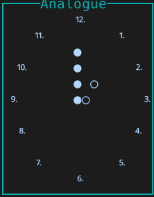
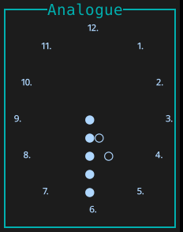
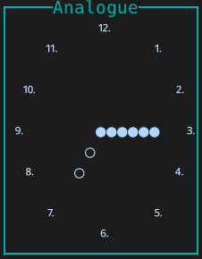
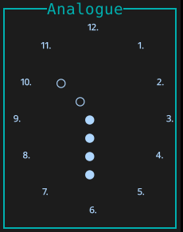

# ⏰  analogue.nvim

An analogue clock for neovim tui implemented purely in Lua.






## ✨ Features
- simple and minimal design
- 17 x 11 dimensional character box
- highly flexible position (floated window)
- clock refresh every ~3 minute
- configurable highlights and components (hands, dials) _soon_

## ⚡️ Requirements

- Neovim >= 0.9.4
- Compatible with Terminal UI (tui) environment

## 📦 Installation

Install the plugin with your preferred package manager:

### [packer.nvim](https://github.com/wbthomason/packer.nvim)

```lua
use "sinabyr/analogue.nvim"
```
#### Setup
```lua
-- plugin/analogue.lua
require("analogue").setup({
    -- override default options
})
```

## ⚙️ Configuration


Analogue comes with the following default configuration:

```lua
fixed_position = 'bottom-right' -- valid options are: "bottom-right", "bottom-left", "top-right", "top-left"
adjusted_position = { -- user customized position of the clock (it's applied after fixed_position)
    x = 0,
    y = 0,
}
auto_start = true, -- initializes the clock on startup
hide_title = false -- hides Analogue title
border = 'rounded' -- any neovim-valid window border _(single, double, rounded, { "/", "-", "\\", "|" }, {'●'})_
```

## 🚀 Commands


Analogue comes with the following commands:

- `AnalogueOpen`: initialize and display the clock
- `AnalogueClose`: destroy the clock and clean up
- `AnalogueReset`: reset the clock position to preset `fixed_position` + `adjusted_position`
- `AnaloguePosition [pos]`: set the clock position to `pos`
- `AnaloguePositionX [num]`: move the clock `num` units on x-axis (_negative values are supported_)
- `AnaloguePositionY [num]`: move the clock `num` units on y-axis (_negative values are supported_)
- `AnalogueHide`: hide the clock _(soon)_

> 💡 if `auto_start` is set to false, then clock can be later initialized with `AnalogueOpen` command


### API

_(Soon)_


## 🎨 Highlights

_(Soon)_

